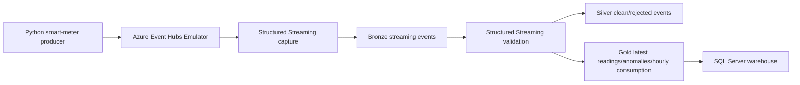
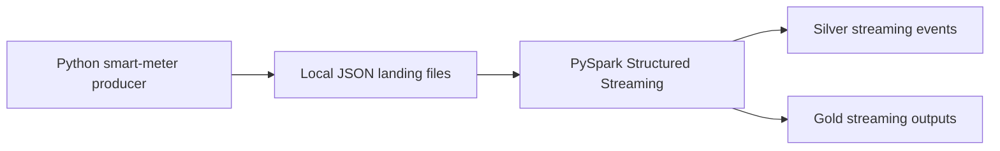

# Streaming Architecture

Phase 4 supports a primary Event Hubs Emulator path and a reliable local file-mode fallback.

## Primary Mode

## Fallback File Mode

File mode is intentionally first-class because local Event Hubs and Spark connector setup can vary by machine.

## Lakehouse Outputs

Bronze:

- `data_lake/bronze/streaming_events/`
- `data_lake/bronze/streaming_events_landing/`

Silver:

- `data_lake/silver/clean_streaming_events/`
- `data_lake/silver/rejected_streaming_events/`

Gold:

- `data_lake/gold/latest_meter_readings/`
- `data_lake/gold/streaming_anomaly_events/`
- `data_lake/gold/hourly_streaming_consumption/`
- `data_lake/gold/streaming_pipeline_metrics/`

Checkpoints:

- `checkpoints/eventhub_to_bronze/`
- `checkpoints/bronze_to_silver_gold/`
